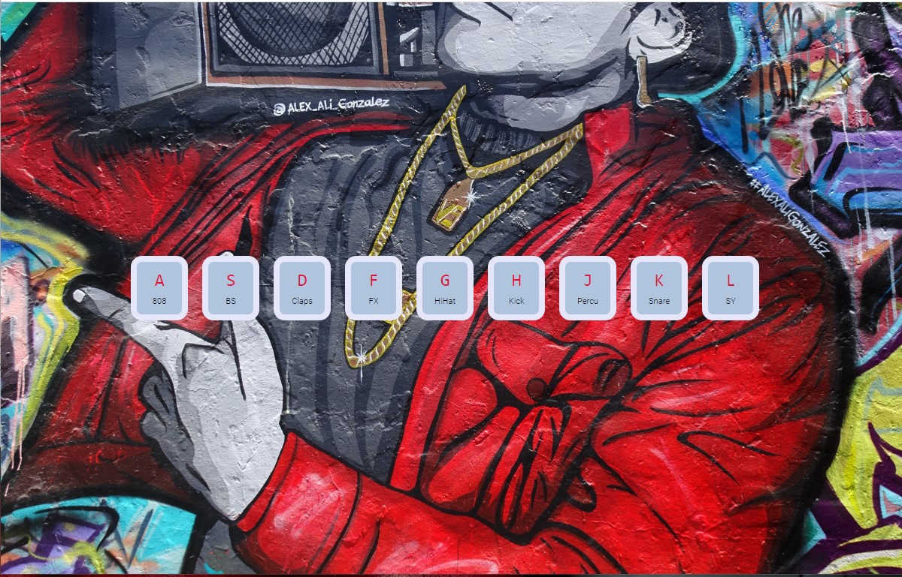

# <h1 align="center"> 👋Welcome to the hipHopper🎵 👋 </h1>
Can you make your own beats (I don't mind if it sounds bad😂). 

Yes!! We can!! This is my answer to that. 
With this app hipHopper, now I can create my own hip hop beats; you can too. Don't be put off if it sounds like amateur; it's just for fun😀

## Live URL
Wanna try it out, I got you covered 😎

Here's the live URL: http://hippy-hop.surge.sh/

## How To
This is how the app looks like-

Just press the letters shown as button, it will play the corresponding sounds. Play with the combinations for a while to be a pro MC😋

## Tech I Used
This app is purely made with vanilla JavaScript & raw HTML/CSS. It is to demonstrate, if you can be creative you can make something amazing out of those core technologies.

Key topics-
+ **HTML:** I used custom data- attribute & audio tag
+ **CSS:** I used Flexbox to position the image, transition to the effects key button. And color contrast is tested by various plugins
+ **JS:** I used DOM manipulation technique to co-ordinate transition and classes. Events that I used are mainly keydown and transitionend

## Disclaimer
+ I didn't made this sound myself as I am not a producer. They are open source sounds from internet. Can't be used for commercial purpose.
+ The images are from Unsplash & rights belong to the respective artist.
+ This is project is part of javascript challenge by Wes Bos namely JavaScript30. Awesome Challenge! Couldn't recommend it more. https://javascript30.com/
